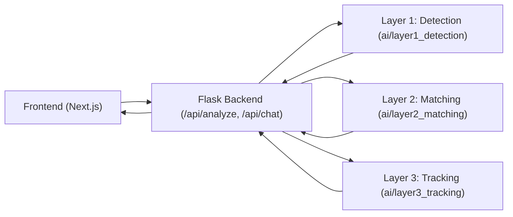

# Technical Architecture

## 1) High-Level Architecture

```text
project-root/
├── app.py
├── backend/
│   ├── app.py
│   ├── auth_system/
│   ├── routes/
│   ├── services/
│   ├── middleware/
│   ├── schemas/
│   ├── config/
│   ├── utils/
│   ├── templates/
│   └── static/
├── ai/
│   ├── layer1_detection/
│   │   ├── model.py
│   │   ├── inference.py
│   │   ├── data_loader.py
│   │   ├── frame_extractor.py
│   │   ├── video_split.py
│   │   ├── models/
│   │   └── utils.py
│   ├── layer2_matching/
│   │   ├── pipeline.py
│   │   ├── matching_service.py
│   │   ├── insights.py
│   │   ├── schemas.py
│   │   ├── clip_model.py
│   │   ├── faiss_index.py
│   │   ├── audio/
│   │   ├── similarity/
│   │   ├── tracking/
│   │   ├── nlp/
│   │   └── risk/
│   ├── layer3_tracking/
│   │   ├── main.py
│   │   ├── growth_analysis.py
│   │   ├── api/
│   │   ├── db/
│   │   ├── services/
│   │   ├── tracker/
│   │   └── utils/
│   └── shared/
│       ├── file_utils.py
│       ├── preprocessing.py
│       └── feature_extraction.py
├── frontend/
│   ├── dashboard-app/
│   └── legacy/
├── data/
│   └── datasets/
├── scripts/
│   ├── train_model.py
│   └── evaluate.py
├── tests/
│   └── layer3/
└── docs/
    ├── TECHNICAL_README.md
    └── layers/
```

## 2) Data Flow



## 3) Responsibilities by Folder

- `backend/`: HTTP API, auth, middleware, templates, route orchestration.
- `ai/layer1_detection/`: core classification and heatmap-ready detection artifacts.
- `ai/layer2_matching/`: multimodal source matching, embeddings, external discovery.
- `ai/layer3_tracking/`: spread/risk tracking, timeline and alert intelligence.
- `ai/shared/`: reusable utilities for preprocessing and feature operations.
- `frontend/dashboard-app/`: dashboard client app.
- `scripts/`: training/evaluation entry points.
- `tests/`: automated checks and hardening tests.

## 4) File Move Map (Old -> New)

### Backend and UI
- `app.py` -> `backend/app.py` (root `app.py` is now a thin entrypoint)
- `auth_system/*` -> `backend/auth_system/*`
- `templates/*` -> `backend/templates/*`
- `static/*` -> `backend/static/*`

### Layer 1
- `data_loader.py` -> `ai/layer1_detection/data_loader.py`
- `frame_extractor.py` -> `ai/layer1_detection/frame_extractor.py`
- `inference.py` -> `ai/layer1_detection/inference.py`
- `video_split.py` -> `ai/layer1_detection/video_split.py`
- `models/*` -> `ai/layer1_detection/models/*`
- `utils.py` -> `ai/shared/file_utils.py`

### Layer 2
- `layer2_pipeline.py` -> `ai/layer2_matching/pipeline.py`
- `layer2_api.py` -> `ai/layer2_matching/matching_service.py`
- `layer2_schemas.py` -> `ai/layer2_matching/schemas.py`
- `layer2_insights.py` -> `ai/layer2_matching/insights.py`
- `credibility.py` -> `ai/layer2_matching/credibility.py`
- `audio/*` -> `ai/layer2_matching/audio/*`
- `similarity/*` -> `ai/layer2_matching/similarity/*`
- `tracking/*` -> `ai/layer2_matching/tracking/*`
- `nlp/*` -> `ai/layer2_matching/nlp/*`
- `risk/*` -> `ai/layer2_matching/risk/*`

### Layer 3
- `layer3/*` -> `ai/layer3_tracking/*`
- Layer 3 tests moved to `tests/layer3/*`

### Frontend
- `frontend_source/dashboard-app/*` -> `frontend/dashboard-app/*`
- `frontend_source/deepfake_detector_ui.html` -> `frontend/legacy/deepfake_detector_ui.html`
- `frontend_source/DeepfakeDetector_1.jsx` -> `frontend/legacy/DeepfakeDetector_1.jsx`

### Scripts and Docs
- `train.py` -> `scripts/train_model.py`
- `evaluate.py` -> `scripts/evaluate.py`
- `LAYER1_README.md` -> `docs/layers/LAYER1_README.md`
- `LAYER2_README.md` -> `docs/layers/LAYER2_README.md`
- `dataset/*` -> `data/datasets/*`

## 5) Entry Points

- Backend (recommended): `python app.py`
- Backend (module): `python -m backend.app`
- Frontend: `cd frontend/dashboard-app && npm run dev`
- Layer 2 service (FastAPI): `python -m ai.layer2_matching.matching_service`
- Layer 3 service (FastAPI): `python -m ai.layer3_tracking.main`

